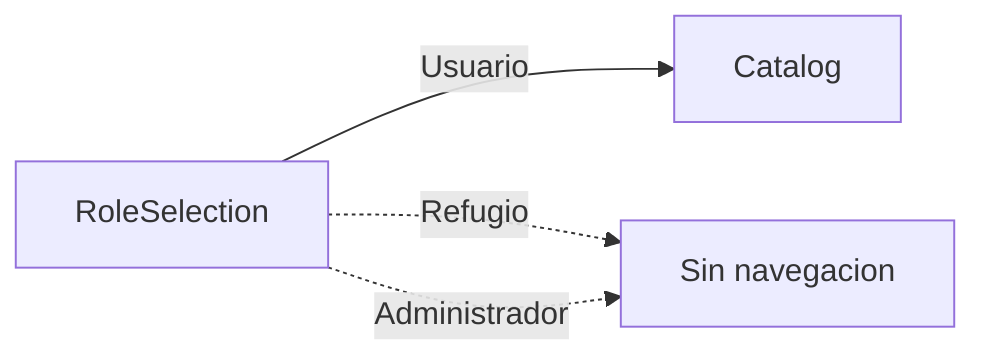

# Estructura base HuellitasSV con React Navigation

## Contexto

El proyecto vive en [`HuellitasSV/`](c:\Users\unice\proyectos\HuellitasSV\HuellitasSV): Expo SDK ~57, React 19, `App.js` aún es el boilerplate. No hay carpeta `src` ni React Navigation instalado.

## 1. Dependencias

Desde `HuellitasSV/`, instalar con `npx expo install` para alinear versiones con el SDK:

```bash
npx expo install @react-navigation/native @react-navigation/native-stack react-native-screens react-native-safe-area-context
```

## 2. Árbol de archivos a crear

```
HuellitasSV/
├── App.js                          (actualizar)
└── src/
    ├── theme/colors.js
    ├── components/PrimaryButton.js
    ├── screens/RoleSelectionScreen.js
    ├── screens/CatalogScreen.js
    └── navigation/AppNavigator.js
```

## 3. Implementación por archivo

### [`src/theme/colors.js`](c:\Users\unice\proyectos\HuellitasSV\HuellitasSV\src\theme\colors.js)

Exportar:

```js
export const colors = {
  primary: '#0EA5E9',
  background: '#F8FAFC',
  text: '#1E293B',
  card: '#FFFFFF',
};
```

### [`src/components/PrimaryButton.js`](c:\Users\unice\proyectos\HuellitasSV\HuellitasSV\src\components\PrimaryButton.js)

`TouchableOpacity` con `title` y `onPress`: fondo `colors.primary`, `borderRadius: 8`, `padding: 12`, texto blanco centrado.

### [`src/screens/RoleSelectionScreen.js`](c:\Users\unice\proyectos\HuellitasSV\HuellitasSV\src\screens\RoleSelectionScreen.js)

- Fondo blanco, título grande "HuellitasSV".
- Tres `PrimaryButton`: Usuario, Refugio, Administrador (margen entre ellos).
- Solo Usuario: `navigation.navigate('Catalog')`. Refugio y Administrador sin navegación (`onPress` vacío).

### [`src/screens/CatalogScreen.js`](c:\Users\unice\proyectos\HuellitasSV\HuellitasSV\src\screens\CatalogScreen.js)

- `SafeAreaView` de `react-native-safe-area-context` (ya instalado con Navigation).
- Estado inicial = el arreglo `mockPets` exacto que indicaste.
- `FlatList` con tarjetas blancas (`colors.card`), sombra suave (`elevation` + sombra iOS), `Image` de `img`, nombre en negrita, especie y edad.
- Botón pequeño "Adoptar" por tarjeta (`TouchableOpacity` compacto con color primary; sin lógica de adopción aún).

### [`src/navigation/AppNavigator.js`](c:\Users\unice\proyectos\HuellitasSV\HuellitasSV\src\navigation\AppNavigator.js)

Stack nativo:

- `initialRouteName="RoleSelection"`
- Pantallas: `RoleSelection` → `RoleSelectionScreen`, `Catalog` → `CatalogScreen`

### [`App.js`](c:\Users\unice\proyectos\HuellitasSV\HuellitasSV\App.js)

Reemplazar el boilerplate por:

```jsx
import { NavigationContainer } from '@react-navigation/native';
import AppNavigator from './src/navigation/AppNavigator';

export default function App() {
  return (
    <NavigationContainer>
      <AppNavigator />
    </NavigationContainer>
  );
}
```

## Flujo de navegación



## Criterio de listo

- Dependencias en `package.json`.
- Carpeta `src` con los 5 archivos descritos.
- Al iniciar la app: pantalla de roles → botón Usuario abre el catálogo con las 3 mascotas mock.